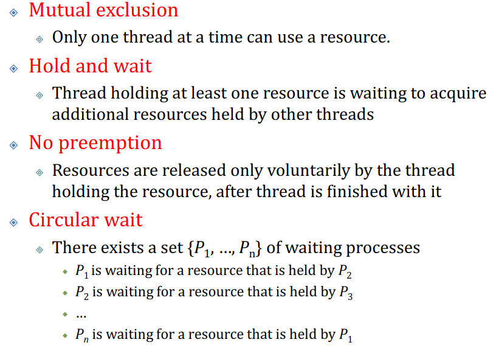
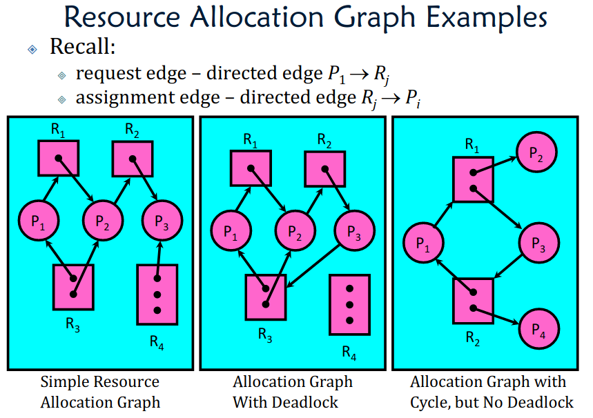

# Deadlock

## Starvation VS Deadlock

### Starvation

thread waits indefinitely

- Low-priority thread waiting for resources constantly in use by high-priority threads

### Deadlock

circular waiting for resources

### Compare

Deadlock -> Starvation, but not vice versa

- Starvation can end (but does not have to)
- Deadlock cannot end without external intervention

## Conditions

### All of four conditions should be satisfied

### ==Cycle != Deadlock==

