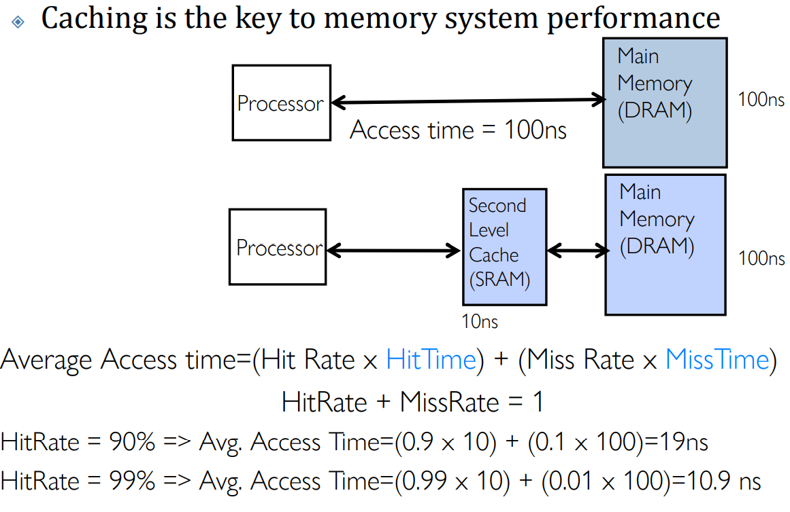
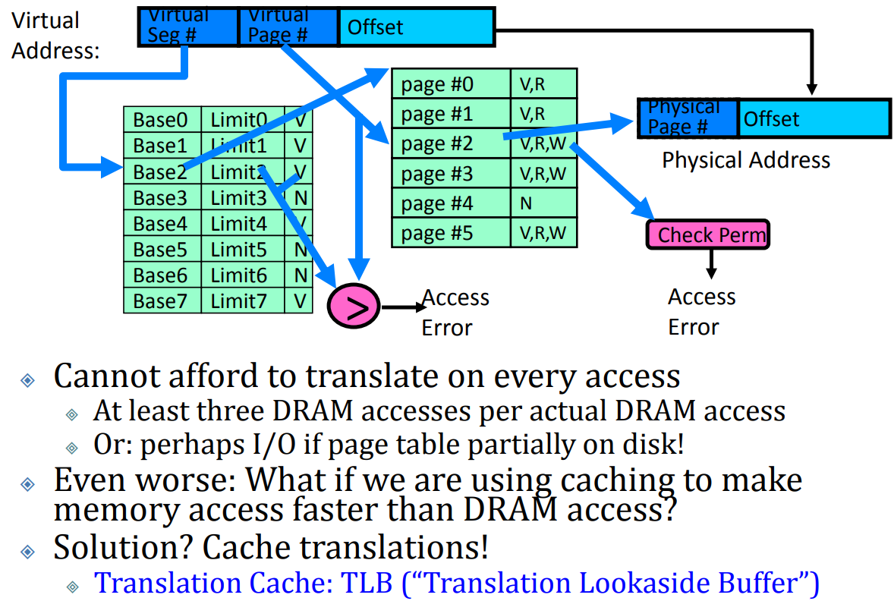

# Caching & Demand page

## Cacheing

**Cache**: a repository for copies that can be accessed more quickly than the original

**Important measure**: $Average~Access~time = (Hit~Rate * Hit~Time) + (Miss~Rate * Miss~Time)$

> 判断是否Hit的时间可以忽略，Hit Time & Miss Time 只计算读写开销
>
> 所以，下图中Miss Time是100ns而不是110ns

**Translation Cache**: TLB (“Translation Lookaside Buffer”)

